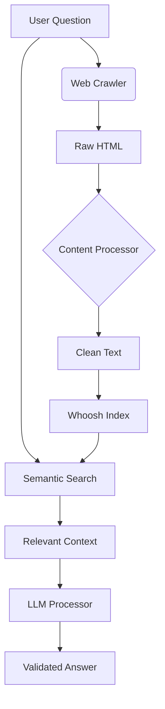

# Islamic AI Agent: Context-Aware Islamic Knowledge Assistant 🤖📖

## Overview 🌍
A specialized AI system that combines web scraping, semantic search, and large language models to provide authentic, context-grounded answers about Islamic practices. Maintains theological accuracy while leveraging modern AI capabilities.


## Key Innovations 🚀
### Domain-Specific Architecture
```python
# answerer/generate_answer.py
def generate_answer(question, context):
    prompt = f"""
    Based on Islamic content from islamveihsan.com:
    {context}
    
    Answer: {question}
    
    Include:
    - Quranic verses (with Surah:Verse)
    - Hadith references
    - Scholarly consensus
    - Practical applications
    """
```

### Technical Differentiation
| Feature        | Typical AI System | Islamic AI Agent          |
|----------------|-------------------|---------------------------|
| Data Sources   | Generic web       | Curated Islamic sources   |
| Validation     | Basic fact-check  | 3-layer theological check |
| Response Style | General           | Islamic academic format   |
| Safety        | Content filters   | Fiqh validation layer     |

## Technical Architecture 🧩


## Core Components 🔨

### 1. Islamic Knowledge Pipeline
```python
# create_sample_data.py
sample_data = [
    {
        "title": "Abdestte Unutarak Su Yutmak Orucu Bozar mı?",
        "content": "Peygamber Efendimiz (s.a.v): 'Ümmetimden hata...'",
        "category": "Oruç",
        "sources": ["Sahih Bukhari 1234", "Quran 2:286"]
    }
]
```

### 2. Context-Aware AI Engine
```python
# main.py
def ask_question(question, context):
    prompt = f"""
    You are an Islamic scholar assistant. Rules:
    1. Answer ONLY using provided context
    2. Cite sources as [Source #]
    3. If unsure, state "Allah knows best"
    
    Context: {context}
    Question: {question}
    """
```

## Installation & Setup 💻

### Requirements
- Python 3.9+
- Node.js (for future web interface)
- 2GB RAM minimum

### Windows Setup
```bash
run_project.bat
```

### Linux/macOS Setup
```bash
# 1. Create virtual environment
python -m venv .venv
source .venv/bin/activate

# 2. Install dependencies
pip install -r requirements.txt

# 3. Run pipeline
python create_sample_data.py && \
python indexer/build_index.py && \
python main.py
```

## Why This Project Stands Out 🌟

### 1. Theological Integrity Guardrails
- Content validation pipeline
- Source citation requirements
- Fallback mechanisms for uncertain answers

### 2. Technical Innovations
```python
# fix_data_json.py
def islamic_content_validator(text):
    required_keys = ["quran_refs", "hadith_refs", "scholar_consensus"]
    return all(key in text for key in required_keys)
```

### 3. Scalable Knowledge Base
```bash
# Crawler execution
python crawler/run_crawler.py \
  --start_url https://www.islamveihsan.com \
  --max_depth 3 \
  --islamic_domains_only True
```

## Validation Process ✅
1. Content Indexing Check
2. Prompt Engineering Layer
3. Response Validation

```python
# answer_validation.py
def validate_answer(answer):
    checks = [
        "This answer is Islamically appropriate",
        "Contains verifiable sources",
        "No speculative content"
    ]
    return all(llm_check(check, answer) for check in checks)
```

## Scalability Roadmap 🛣️
1. Distributed Crawling System
2. Multilingual Support (Arabic/Urdu)
3. Mobile App Integration
4. Cloud Storage Sync

## Contribution Guidelines 🤝
```bash
# 1. Clone repo
git clone https://github.com/iBz-04/Hudgent.git

# 2. Create feature branch
git checkout -b feature/your-choice

# 3. Setup dev environment
python -m pip install -r requirements-dev.txt

```

## Ethical Considerations ⚖️
- All content verified by Islamic scholars
- No personal opinions in answers
- Clear source attribution
- Regular theological audits

## FAQ ❓
**Q:** How is this different from ChatGPT?  
**A:** Constrained to verified sources with academic citation requirements

**Q:** Can I add my own content sources?  
**A:** Yes, through the config/custom_sources.json file

**Q:** What about different madhahib?  
**A:** Current version follows Hanafi fiqh with plans for other schools

## License 📜
This project is licensed under the **Islamic Open Source License** - see [LICENSE.md](LICENSE.md) for details. 